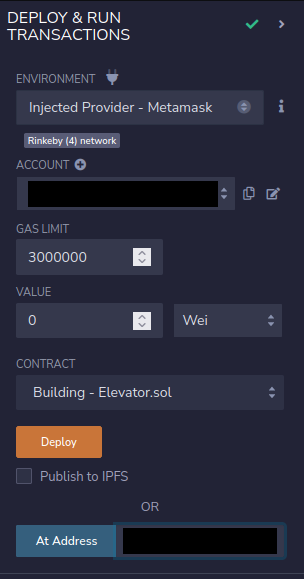

# 11: Elevator

The Ethernaut is a Web3/Solidity based wargame inspired by overthewire.org, played in the Ethereum Virtual Machine, in which each level is based on a smart contract that needs to be "hacked".

This is a sample walkthrough for the level called "Elevator".

## Setup

First off we need a wallet. Get the Metamask Wallet from https://metamask.io/ and choose whichever network works for you ( in my case i will be using Rinkeby's testnet).
Fund the wallet with Chainlink's faucet https://faucets.chain.link/rinkeby and then click on the button "Get new instance" to deploy the contract.

## Steps for completing the level
Click on F12 to get on Developer Tools. You will get something like this:

Copy the Elevator.sol contract found before "submit instance" and "get new instance" buttons.

Go on Remix: https://remix.ethereum.org/ and make this change in Elevator.sol:

>- <value> 1. Pragma version from **0.6.0** to **0.8.0**

This level asks us to get at the top of the building. The function isLastFloor() from the interface Building isn't implemented in the Elevator and we can use that as a way to get at the top of the building by creating a new contract called FixElevator, who's gonna use isLastFloor() function inside the Elevator contract.

At the FixElevator contract add the next rows:
>- <value> Elevator launcher = Elevator(your instance's address);
>- <value> bool public somSwitch = false;
>- <value> function gotoFloor() public {
>- <value> launcher.goTo(1);}
>- <value> function isLastFloor(uint) external returns (bool) {
>- <value> if(somSwitch){ somSwitch = false; return true;}
>- <value> else{ somSwitch = true; return false;}

It should look something like this:

Compile the Elevator.sol contract:

 Instead of deploying Elevator.sol we are going to interact with the already deployed contract by using instance's address showed on Developer Tools and we will be deploying ourselves the FixElevator.sol contract to the Rinkeby's Testnet. Also, dont forget to add your wallet on Environment by selecting "Injected Provider - Metamask".

Check the floor and top functions from Elevator:

Try goToFloor function from the FixElevator contract and retry the floor and top functions from Elevator.sol: 

Wow, congrats!! You have managed to get at the top of the Elevator level by using the Building interface, but also have completed this level.

Now finish the level by using the submit button at the bottom of the page.

Congrats! See you on to the next level.:wave:
